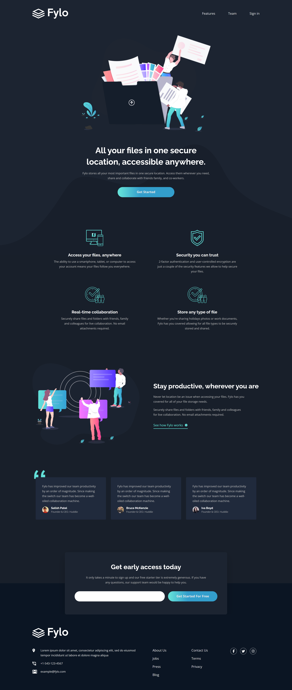

## Frontend Mentor - Fylo dark theme landing page solution

This is a solution to the [Fylo dark theme landing page challenge on Frontend Mentor](https://www.frontendmentor.io/challenges/fylo-dark-theme-landing-page-5ca5f2d21e82137ec91a50fd). Frontend Mentor challenges help you improve your coding skills by building realistic projects.

<p>
  <a href="https://www.frontendmentor.io/solutions/mobile-first-responsive-without-zero-media-queries-vhMhfqkhn3">
    </a>
  <a href="https://haquanq-frontendmentor.github.io/fylo-dark-theme-landing-page/">
    </a>
  <a href="./LICENSE"
    ></a>
</p>

## Table of contents

- [Project Overview](#sunrise-project-overview)
- [Tech Stack and Approach](#stars-tech-stack-and-approach)
- [Local Development](#seedling-local-development)
- [Deployment](#maple_leaf-deployment)

## :sunrise: Project Overview

### Challenge Requirements

- View the optimal layout for the site depending on their device's screen size
- See hover states for all interactive elements on the page

### Progress

Features

- [x] Subscription form
  - [x] Show error when input is invalid
  - [x] Accessible to screen readers

Accessibility

- [x] Responsive accross different screen sizes
- [x] Added custom indicator when interactive elements focused
- [x] Screen readers can announce form controls behaviors

### Preview (Desktop)



## :stars: Tech Stack and Approach

### Built with

- **HTML5** – Semantic structure
- **CSS Grid & Flexbox** – Layout
- **PostCSS** – Nested rules, custom media queries, future CSS features, minification
- **JavaScript** - Interactivity and application logic.
- **Vite** - Fast development server, production build and easy configuration.

### Approach

- Mobile-first workflow for better performance on smaller devices
- Accessibility guided by [ARIA Authoring Practices Guide (APG)](https://www.w3.org/WAI/ARIA/apg/).

## :seedling: Local development

### Prerequisites

Install the following:

- Git (latest LTS recommended)
- Node.js (latest LTS recommended)

### Setup

```
git clone https://github.com/haquanq-frontendmentor/fylo-dark-theme-landing-page.git
cd fylo-dark-theme-landing-page
npm install
```

### Start development server

```
npm run dev
```

## :maple_leaf: Deployment

Deployed to Github Pages via Github Actions (manually triggered).
